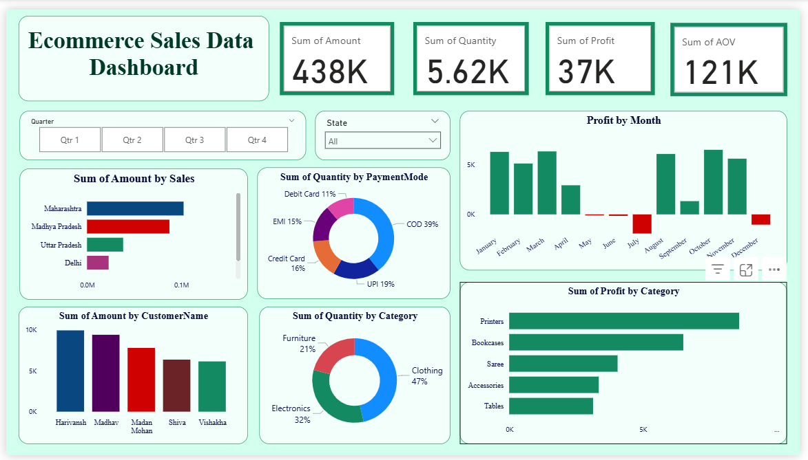

# Ecommerce Sales Dashboard (Power BI)

An interactive dashboard built using Power BI to analyze ecommerce sales data. It covers total sales, profits, quantity sold, customer insights, and product/category performance.

## Key Metrics
- Total Sales: 438K
  Quantity Sold: 5.62K
- Profit: 37K
- Average Order Value: 121K

## Files Included
- `Ecommerce_Sales_Dashboard.pbix`
- `DashBoard_screenshot.png`

## Tools Used

- **Power BI Desktop**
- **Excel / CSV Data Source**
- Custom color theme and slicers for interactivity
  
## ▶️ How to Use
1. Download all files
2. Open `.pbix` file in Power BI Desktop
3. Explore the visuals and filters

🎓 Built as part of my Data Analyst learning journey.
